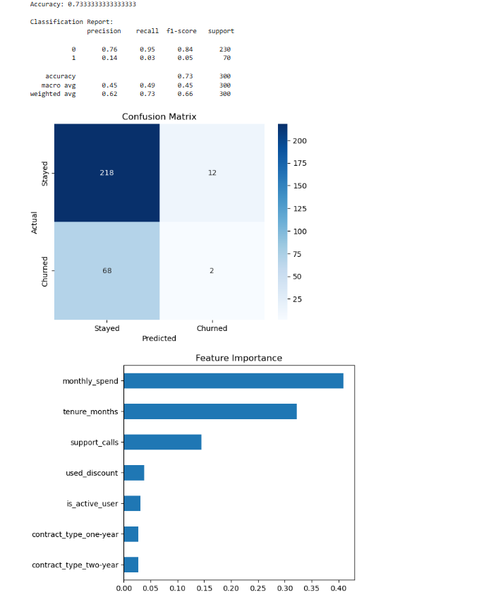

# Predictive-Modeling
Generate synthetic customer data.  Build a machine learning model to predict churn.  Evaluate the model. This is a classic classification problem, often used in business to proactively retain customers.

